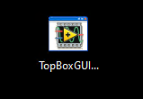
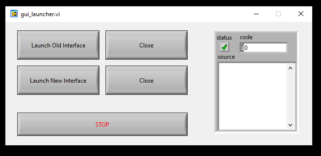
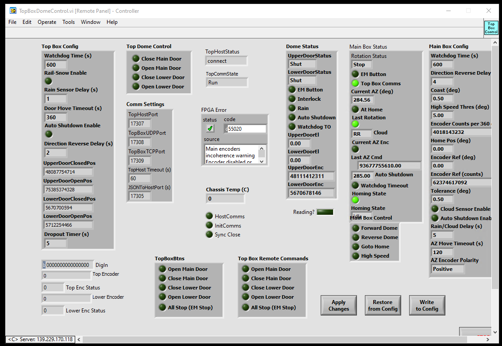
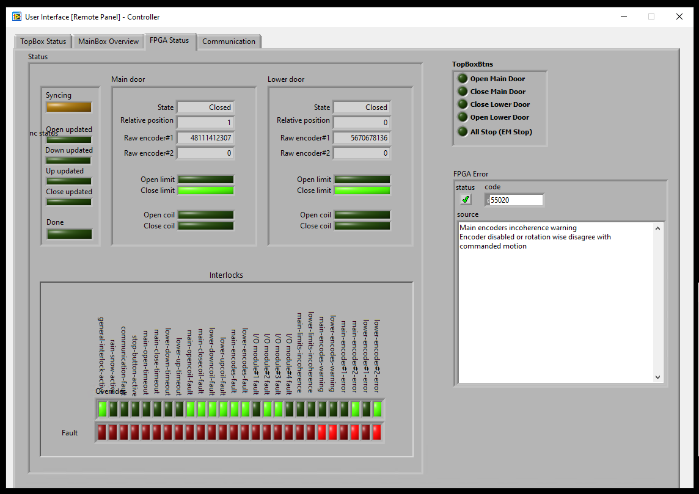

.. toctree::
    :maxdepth: 2

.. note::

   **This technote is a work-in-progress.**

##############################
TopBox Controller Improvements
##############################

Abstract
==========

This document describes the changes made by the NOIRLab team in the original Shutter Control Box (SCB) software.

Introduction
================

The NOIRLab team was asked to improve the SCB software in oder to avoid the "phantom dome closures", described in the https://jira.lsstcorp.org/browse/OBS-89. This document describes the improvements to the software.

TopBox cRIO Information
===============================

Model: cRIO-9032

S/N: 01BF561A

IP Address: 139.229.170.118

MAC Eth0: 00:80:2f:27:7e:c7

MAC Eth1: 00:80:2f:27:7e:c8

FQDN (DNS name): auxtel-crio01.cp.lsst.org

MainBoxBox cRIO Information
===============================

Model: cRIO-9042

S/N: 022E7BDD

IP: 139.229.170.56

MAC Eth0: 00:80:2F:40:37:B2

MAC Eth1: 00:80:2F:40:37:B3

FQDN (DNS name): auxtel-dome-mainbox.cp.lsst.org (previous was: auxtel-dome-crio-main.cp.lsst.org)

Telnet Port: 17310

Software Updates
================================================

New Control Software Commands
-------------------------------------

**MO** : The MO (Maintenance On) command enables the Maintenance Mode.

**MF** : The MF (Maintenance Off) command disables the Maintenance Mode.

**d OVE** : The OVE (Override Enable) command enables the override number “d”. The number “d” is defined as an 8-bit unsigned integer (U8). Check the List Of Override commands for more information.

**d OVD** : The OVD (Override Disable) command disables the override number “d”. The number “d” is defined as an 8-bit unsigned integer (U8). Check the List Of Override commands for more information.

For the complete list of telnet commands go to ...

**List Of Override**

* 0: stop-button-active
* 1: general-interlock-active
* 2: rain-snow-active
* 3: communication-fault
* 4: main-open-timeout
* 5: main-close-timeout
* 6: lower-down-timeout
* 7: lower-up-timeout
* 8: main-limits-incoherence
* 9: lower-limits-incoherence
* 10: main-encoder#1-incoherence
* 11: main-encoder#2-incoherence
* 12: lower-encoder#1-incoherence
* 13: lower-encoder#2-incoherence
* 14: main-encoder#1-error
* 15: main-encoder#2-error
* 16: lower-encoder#1-error
* 17: lower-encoder#2-error
* 18: main-opencoil-fault
* 19: main-closecoil-fault
* 20: lower-downcoil-fault
* 21: lower-upcoil-fault
* 22: IO-module1-fault
* 23: IO-module2-fault
* 24: IO-module3-fault
* 25: IO-module4-fault

**OV?** : Issuing the OV? (OVerride Status?) command gives the full override status. It is intended for engineering setup purposes only.

**CF** : The CF (Clear Fault) command clears the faults in the FPGA.

**SY** : The SY (Sync) command starts the Encoder-Limits Synchronization routine. This enables and executes a safe drive loop for synchronizing the encoder reading with the respective limit switch on each process. If this flag is set to TRUE both doors will begin to move. Please wait for SYNC-DONE to get TRUE. The STOP command can abort the process.

Clear Faults Procedure
------------------------

* Enter the TopBox cRIO with telnet:

.. code-block:: bash      
      
      telnet auxtel-crio01.cp.lsst.org 17307
      MO
      CF
      MF

* **MO** enables the Maintenance Mode, **CF** clears the fauls, and **MF** disables the Maintenance Mode.

New Logging Feature
------------------------

This new feature will log (1) commands sent by either the host computer though telnet communication or the CSC, (2) internal software failures, and (3) system failures, like encoder reading incoherences, limit switch incoherences, timeouts, loss of communications between TopBox and MainBox controllers, etc. This log can be read offline and is intended to be just for debugging purposes.

The commands will be logged with the **CMD** label before the command, the internal failures will have the **ERROR** label before the error information, and the system failures will have the **FAILURE** label before the data. There will be the **INFO** label to any event that happens and brings important information.

This logging information will be saved in the ``log.txt`` file places in the ``/home/log/`` directory. If the log directory is not created, please do:

.. code-block:: bash      
      
      admin@NI-cRIO# mkdir /home/log/
      admin@NI-cRIO# chown -R lvuser:ni /home/log/

New Telnet Port
------------------------

The new telnet port is ``17307``.
So, to connect to the TopBox controller, do this:

.. code-block:: bash      
      
      telnet auxtel-crio01.cp.lsst.org 17307
      At the > prompt, type HELP.

New TopBox GUI
==================

Since the NORLab team removed the graphical user interface (GUI) based on the Internet Explorer web navigator, we created a new way to access the old and new user interfaces.
This was developed with LabVIEW and is based on the NI VI-Server technology.
To access the TopBox GUI please follow these steps.

* Go to ``aux-brick01.cp.lsst.org`` machine. The password is stored in the 1Password bault.

* Open the ``TopBoxGUI`` executable from the Desktop.

* Pick either the ``Launch Old Interface`` option or the ``Launch New Interface``.

* This is the Old Interface view:

* This is the New Interface view:

Note: this is a temporary solution for TopBox only.
The NOIRLab team is working on a new web-based GUI.
Stay tunned.

This page was last modified |today|.
